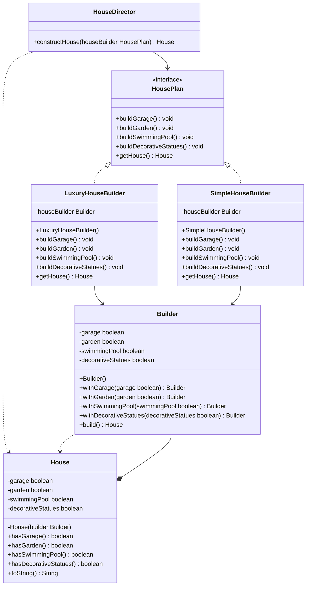

# Builder Pattern - House Construction

Este proyecto implementa el patrón Builder para la construcción de diferentes tipos de casas en Java.

## Diagrama de Clases



## Descripción

El patrón Builder permite construir objetos complejos paso a paso. En este ejemplo:

- **HousePlan**: Interfaz que define los pasos para construir una casa
- **LuxuryHouseBuilder**: Construye casas de lujo con todas las características
- **SimpleHouseBuilder**: Construye casas simples con características básicas
- **HouseDirector**: Dirige el proceso de construcción
- **House**: El producto final con su Builder interno

## Uso

```java
// Construcción dirigida
HouseDirector director = new HouseDirector();
House luxuryHouse = director.constructHouse(new LuxuryHouseBuilder());
House simpleHouse = director.constructHouse(new SimpleHouseBuilder());

// Construcción directa
House customHouse = new House.Builder()
    .withGarage(true)
    .withGarden(true)
    .withSwimmingPool(false)
    .withDecorativeStatues(false)
    .build();
```

## Tests

Muestra de la cobertura de tests de 83,18%


